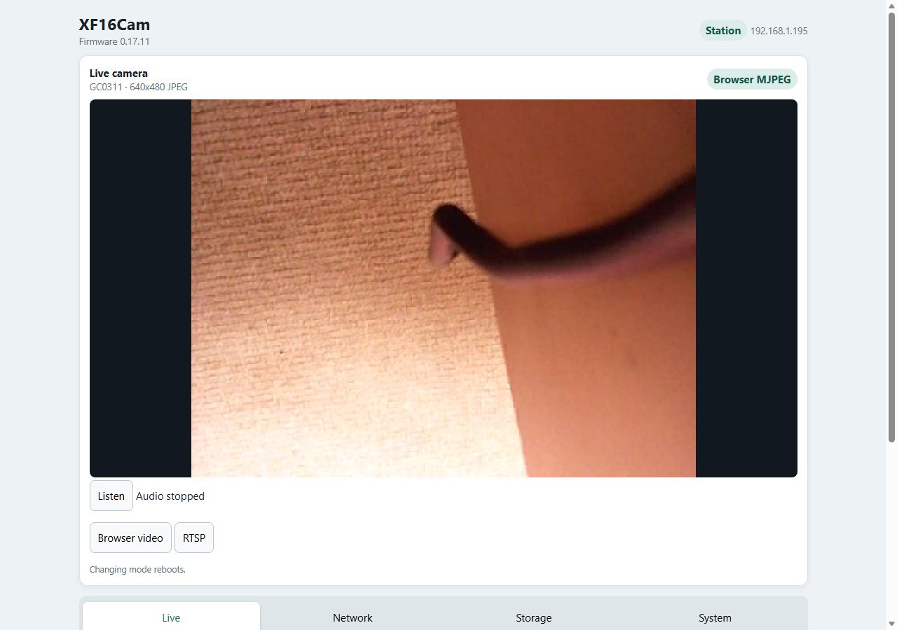
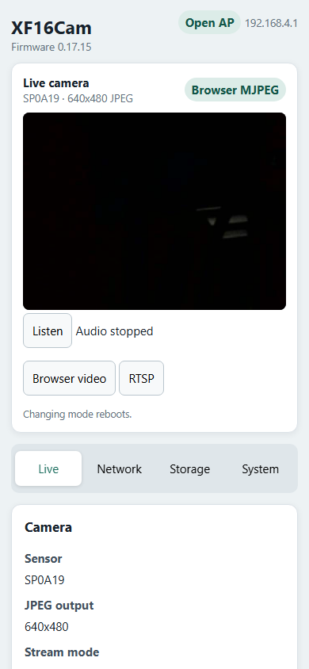

# XF16Cam

[](https://github.com/divadiow/XF16Cam/actions/workflows/build-xf16cam.yml)

XF16Cam is compact, local network-camera firmware for the 1 MiB-flash A9
camera built around the XF16/XR872ET-family platform. It replaces the factory
cloud application with a responsive web console, browser video or RTSP,
microphone audio, Wi-Fi setup, and web OTA - all without PSRAM.

<table>
  <tr>
    <td width="74%"></td>
    <td width="26%"></td>
  </tr>
  <tr>
    <td align="center">Desktop live view</td>
    <td align="center">Responsive phone layout</td>
  </tr>
</table>

The firmware is a standalone application over the XRADIO Skylark SDK. It does
not require an app or an Internet service: after flashing, the camera can stay
entirely on your own network.

## What works

- Browser MJPEG with optional live microphone audio, or single-client RTSP with
  RTP/JPEG and PCMU audio. The two video modes are selected exclusively to fit
  the available SRAM.
- A mobile-friendly web console with Live, Network, Storage, and System pages.
- Open setup AP, nearby-network scan, STA credentials stored in flash, and
  automatic fallback to the setup AP after a failed connection.
- Web OTA with streamed writes and image verification, plus an application-level
  UART recovery command retained whenever XF16Cam boots.
- Automatic camera-sensor probing, QVGA output, and native VGA where the sensor
  and driver support it. Boot continues normally when no sensor is fitted.
- Optional SD-card check, capacity/free-space display, FAT32 format, and safe
  eject.
- Device diagnostics including firmware version, uptime, reset cause, eFuse
  MAC, JEDEC flash identity/capacity, heap and stack headroom, frame statistics,
  XF16 temperature, and an approximate battery-voltage reading.
- Demand-driven camera, SD, and analogue-microphone resources, plus experimental
  manual hibernation with PA20 configured as its wake source; wake validation
  with healthy battery hardware is still pending.

## Is this your A9?

> [!WARNING]
> **A9 describes a product style, not a chipset.** Near-identical cameras have
> shipped with incompatible Beken and Taixin processors. Do not flash XF16Cam
> merely because the case or listing says “A9”.

The supported board has an IC marked `XF16`, commonly with the second line
`PB380EA6341`, a 1 MiB (8 Mbit) SOIC-8 SPI flash, a microSD slot, two side
buttons, and an 18-pin camera-module connector. One known PCB revision is
marked `J9_001_V1.2_20221222`; markings may vary.

<table>
  <tr>
    <td></td>
    <td></td>
  </tr>
  <tr>
    <td align="center">Camera, microphone, and module connector</td>
    <td align="center">XF16, microSD slot, USB, and side buttons</td>
  </tr>
</table>

Factory firmware calls this an ET 1 MiB-flash target and contains several
XR872ET board-profile strings. ROMs recovered from an XF16 A9 and a known
XR872ET device have also matched. The evidence therefore points to a custom
68-pin **XR872ET-family implementation**, not a literal package-for-package
rebadge of the catalogue QFN40 XR872ET. It runs at 240 MHz and this camera has
no PSRAM. See the [hardware guide](docs/hardware.md) for the evidence, pin map,
and more identification detail.

## Getting started

1. Open the camera and confirm the XF16 marking and 1 MiB board layout above.
2. Follow the [serial flashing guide](docs/flashing.md) to make a full factory
   backup and write the **complete** `xf16cam-xr872-v<version>.img` with
   [Easy Flasher](https://github.com/openshwprojects/BK7231GUIFlashTool/releases/latest)
   in `XR872` mode. On these boards, the flashing UART is routed through the
   micro-USB connector's D- and D+ contacts; it is not a USB data interface.
3. After first boot, join the open Wi-Fi network `XF16CAM`. The camera is
   `192.168.4.1` and gives the connected setup device `192.168.4.100`.
4. Open `http://192.168.4.1/`, scan for your Wi-Fi network, enter its password,
   and save. The camera reboots into station mode; the web console remains
   available at its new address.
5. Select **Browser video** in the Live page, or open the default RTSP stream at:

   ```text
   rtsp://<camera-ip>:8554/stream
   ```

   VLC and FFmpeg should use RTSP-over-TCP. In FFmpeg/ffplay, add
   `-rtsp_transport tcp`.

Until tagged releases are introduced, complete serial and compressed OTA images
are available from successful [GitHub Actions builds](https://github.com/divadiow/XF16Cam/actions/workflows/build-xf16cam.yml).
Workflow artifacts are retained for 14 days. The [developer notes](project/example/xf16cam/readme.md)
also cover a reproducible Linux build.

## Buttons and LEDs

| Control | XF16Cam function |
| --- | --- |
| PA15 mode button | Press and release to switch Browser MJPEG ↔ RTSP, save the choice, and reboot. |
| PA20 setup button | Hold for 3 seconds to restore the open `XF16CAM` setup AP and reboot. It is also configured as the hibernation wake input. |
| PA21 status LED | Blinks while starting, stays on when services are ready, and turns off for hibernation. This is usually the blue LED on the tested A9. |
| Red LED | Not controlled or characterised by XF16Cam; it may be part of the board's power/charging circuit. |

The same media and setup operations are available from the web console. PA20
remains the physical wake control after manual hibernation.

## Supported camera sensors

Sensor selection is automatic. Every driver uses the same compact probe,
register-table, and CSI-profile path, making future sensor additions cheap in
both code and SRAM.

| Validation status | Sensors |
| --- | --- |
| Hardware-tested on the XF16 A9 | GC0328, GC0329, GC0309, GC0310, GC0311, GC0312, HI704, SP0A19, SP0A20, SP0828 |
| Included; matching A9 hardware still needed | GC0308, OV7690, SP0A39 |

SP0A39 has additionally been community-tested on a different XF16 PTZ camera,
but not yet on the target A9 board; that report covers sensor video, not PTZ or
IR control. Most landscape sensors default to 320 × 240; native 640 × 480 is
selectable on supported VGA sensors. SP0828 uses its native portrait 240 × 320
mode. The [hardware guide](docs/hardware.md#camera-sensors) lists IDs and
per-sensor resolution support.

## Current limitations

- XF16Cam targets the **1 MiB XF16 A9 board only**. It is not an image for every
  A9-shaped camera or for catalogue XR872AT modules.
- The setup AP, HTTP console, RTSP stream, configuration, and OTA endpoint have
  no authentication or TLS. Use this research firmware only on a trusted local
  network; anyone who can reach it can view, configure, or update it.
- Video is single-client. Browser MJPEG and RTSP cannot run simultaneously, and
  the RTSP server supports interleaved TCP transport only.
- SD-card management works, but still-photo and video recording are not yet
  implemented.
- Battery voltage is approximate and uncalibrated. Charging state, percentage,
  automatic low-voltage cutoff, and the red LED remain unknown.
- OTA images are structurally checked and MD5-verified, but are not
  cryptographically signed.

## Documentation and research

- [Hardware identification, pin map, sensors, and power notes](docs/hardware.md)
- [Backup, serial flashing, first boot, recovery, and OTA](docs/flashing.md)
- [Build, architecture, memory budget, and sensor-driver notes](project/example/xf16cam/readme.md)
- [Long-running XF16 A9 investigation on Elektroda](https://www.elektroda.com/rtvforum/topic4074636.html)
- [Camera-module and sensor identification research](https://www.elektroda.com/rtvforum/topic4121965.html)
- [XRADIO Skylark SDK](https://github.com/XradioTech/xradio-skylark-sdk)

The teardown photographs above were made by `divadiow` during the original
XF16 investigation. See the [image provenance notes](docs/images/README.md).
