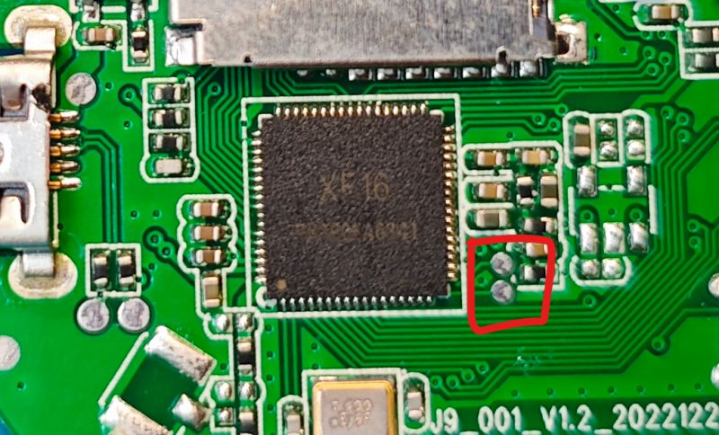

# Flashing and first start

[Project overview](../README.md) · [Hardware guide](hardware.md) ·
[Developer notes](../project/example/xf16cam/readme.md)

Flashing replaces the original 1 MiB image. Read this page once before applying
power; a backup and a verified hardware identity make recovery much easier.

## 1. Confirm the target

Only continue when the board matches the photographs in the
[hardware guide](hardware.md) and the main device is marked `XF16`. Beken, Taixin,
XR872AT, or other A9 variants are incompatible.

XF16Cam uses a 1 MiB (8 Mbit) flash layout. Cameras with other flash capacities
have been observed, but they should not be assumed to use this exact layout.
Keep a verified factory dump if at all possible. Community experiments found
that in-circuit SPI clips sometimes reported changing IDs such as `13 13`,
`8E 80 29`, and `C7 40 14`; compare multiple reads and do not trust a dump that
is not repeatable. An off-board read may be necessary when the rest of the PCB
loads the programmer.

## 2. Choose the correct image

A successful GitHub Actions artifact contains two similarly named firmware
images:

| File | Use |
| --- | --- |
| `xf16cam-xr872-v<version>.img` | Complete image for the first serial flash or UART recovery |
| `xf16cam-xr872-v<version>-ota.img` | Compressed update accepted by an already-running XF16Cam web console |

Do not upload the complete serial image through the web updater. Do not write
the compressed OTA file at flash offset zero.

Until tagged releases are available, select a successful run from the
[XF16Cam build workflow](https://github.com/divadiow/XF16Cam/actions/workflows/build-xf16cam.yml)
and download its `xf16cam-xr872-...` artifact. GitHub may require sign-in and
retains these artifacts for 14 days. `SHA256SUMS` in the artifact lets you check
that the download is intact.

## 3. UART connection

The console is 115200 baud, 8 data bits, no parity, one stop bit, and no flow
control. At PCB level, use **3.3 V UART logic**:

| Camera | USB–UART adapter |
| --- | --- |
| PB0 / TX | RX |
| PB1 / RX | TX |
| GND | GND |

Power the camera through its normal regulated 5 V USB input and share ground
with the adapter. Never put 5 V logic on PB0 or PB1. Desolder the pouch
battery while wiring or flashing, especially if its condition is unknown.

On the photographed A9 revision, the flashing UART is routed through the
micro-USB connector's D- and D+ contacts. They are **UART signals, not USB
data**. A DIY cable or breakout therefore provides access without soldering to
the camera PCB:

| Known cable contact | USB-UART adapter / supply |
| --- | --- |
| Green, D− (camera TX/PB0) | RX at 3.3 V logic; GPIO1 pad on the module-removed NodeMCU donor |
| White, D+ (camera RX/PB1) | TX at 3.3 V logic; GPIO3 pad on the module-removed NodeMCU donor |
| Black, GND | Common ground |
| Red, VBUS | Regulated 5 V camera power |

Cheap cable colours and board revisions can differ; verify the contacts before
applying power. Never connect the D-/D+ pair to a PC USB host and a UART adapter
at the same time. The [original DIY adapter wiring and photographs](https://www.elektroda.com/rtvforum/topic4074636-90.html#21528571)
show a working cable made from a stripped micro-USB lead and a CH340-equipped
NodeMCU board. A normal 3.3 V USB-UART adapter can be used in the same way if
the camera receives a suitable regulated 5 V supply.

## 4. Back up and write with Easy Flasher

Download [BK7231 GUI Flash Tool](https://github.com/openshwprojects/BK7231GUIFlashTool/releases/latest)
(Easy Flasher) v318 or newer and extract it. This version supports the
`XR872`/XF16 BootROM directly.

For the first installation:

1. Extract the XF16Cam workflow artifact and identify the complete
   `xf16cam-xr872-v<version>.img` file. Do not use the `-ota.img` file.
2. Close every terminal using the camera's port. In Easy Flasher, select
   platform `XR872`, the camera's COM port, and 115200 baud.
3. Drag the complete `.img` onto the Easy Flasher window. Alternatively, enable
   **Show advanced options** and use the `...` file button. Do not select
   **Download latest from Web**; that retrieves firmware from a different
   project, not XF16Cam.
4. Select **Firmware backup (read) only** twice. Easy Flasher reads the complete
   capacity reported by the flash and saves each dump under `backups/`. On the
   supported target, each dump must be exactly 1,048,576 bytes. Compare their
   SHA-256 hashes and keep a verified copy somewhere outside this checkout.
5. With the complete XF16Cam image still selected, choose **Backup and flash
   new firmware**. Keep power connected until the operation completes.
6. Remove any recovery straps and reboot the camera normally.

Easy Flasher handles the flash address, reads the JEDEC ID, detects the flash
capacity, validates the XR image structure, and writes the complete `.img` from
offset zero. No manual address or length is needed. If the detected capacity is
not 1 MiB, preserve the full backup and confirm the board variant before
writing this 1 MiB-layout firmware.

On a normally booting factory application or XF16Cam, Easy Flasher first sends
the application-level `upgrade` command and then synchronises with the XR
BootROM. XF16Cam deliberately keeps this console handoff available even if the
camera sensor, Wi-Fi, or storage has failed. The [protocol investigation](https://www.elektroda.com/rtvforum/topic4074636-150.html#21534886)
and [console-enable finding](https://www.elektroda.com/rtvforum/topic4074636-150.html#21536774)
explain the mechanism.

### PB02/PB03 hardware bootstrap

If flash is blank or corrupt, no application is available to receive
`upgrade`. The two boxed test pads below are the XF16 board's PB02/PB03 recovery
straps.



1. Disconnect camera power.
2. Temporarily connect both PB02 and PB03 pads to GND.
3. Apply the camera's normal 5 V power while both pads are low.
4. Release both pads after power-up, then start or retry the Easy Flasher
   operation. Do not leave them grounded for the transfer or for normal boot.

This selects the `00` firmware-update bootstrap state at startup. PB02 and PB03
are also shared with the external flash interface, which is why the temporary
connections must be removed. The [labelled-pad photograph and original test](https://www.elektroda.com/rtvforum/topic4074636-60.html#21523144)
show the exact board location. An off-board SPI restore of the verified factory
backup remains the final recovery route if UART bootstrap cannot communicate.

## 5. First boot

With no saved configuration, XF16Cam starts:

- SSID: `XF16CAM`
- Security: open (no Wi-Fi password)
- Camera address: `192.168.4.1/24`
- One DHCP lease: `192.168.4.100`
- Default media mode: RTSP
- Default video resolution: 320 × 240

Join `XF16CAM` and open `http://192.168.4.1/`. Windows or a phone may warn that
the network has no Internet; remain connected. Use the Network page to scan,
select an SSID, enter its password, and save. The camera reboots and joins that
network. If it cannot connect within about 20 seconds, it returns to the setup
AP.

The console remains available in either AP or STA mode. To watch in a browser,
select **Browser video** on the Live page; changing between Browser and RTSP
persists the choice and reboots. For RTSP use:

```text
rtsp://<camera-ip>:8554/stream
```

## Serial recovery commands

At the 115200-baud console:

```text
wifi ap
wifi sta <ssid> <password>
upgrade
```

`wifi ap` restores setup-AP mode. `wifi sta` saves credentials and reboots.
`upgrade` immediately hands control to the UART BootROM. Easy Flasher normally
sends it automatically. For a manual handoff, issue `upgrade` in the terminal,
close the terminal so it releases the COM port, and then start the Easy Flasher
operation.

Holding the PA20 button for 3 seconds is the no-terminal route back to the open
setup AP.

## Web OTA

Once XF16Cam is running:

1. Download the matching `-ota.img` file.
2. Open **System → Firmware update** in the web console.
3. Choose the OTA image, keep USB power connected, and select **Install update**.
4. Wait for verification and reboot, then reload the page at the same AP or STA
   address.

The upload is streamed into a 372 KiB staging partition and is not selected for
boot until the SDK image structure and MD5 check pass. A bad or interrupted
upload normally leaves the current firmware bootable. OTA is not signed or
encrypted, and the web endpoint has no authentication; use it only on a trusted
network.

## Troubleshooting

- **No serial text:** confirm 115200 8N1, common ground, crossed TX/RX, and that
  the adapter uses 3.3 V logic. Check the opposite micro-USB data contact if the
  board revision routes the pair differently.
- **Easy Flasher cannot synchronise:** close the terminal, reboot normally, and
  let Easy Flasher send `upgrade` again. If the application is alive, issuing
  `upgrade` in the console first is a useful diagnostic. If it is not alive,
  use the PB02/PB03 hardware-bootstrap sequence above. Use an off-board SPI
  restore only if UART bootstrap also fails.
- **No `XF16CAM` AP:** hold PA20 for 3 seconds. If boot never reaches the XF16Cam
  version line, capture the UART log and use serial/SPI recovery.
- **No camera sensor:** this should not block management services. The web page
  should report that no supported sensor was detected.
- **OTA rejected:** verify that the filename ends in `-ota.img`, that it came
  from the same target workflow, and that the upload was not interrupted.
