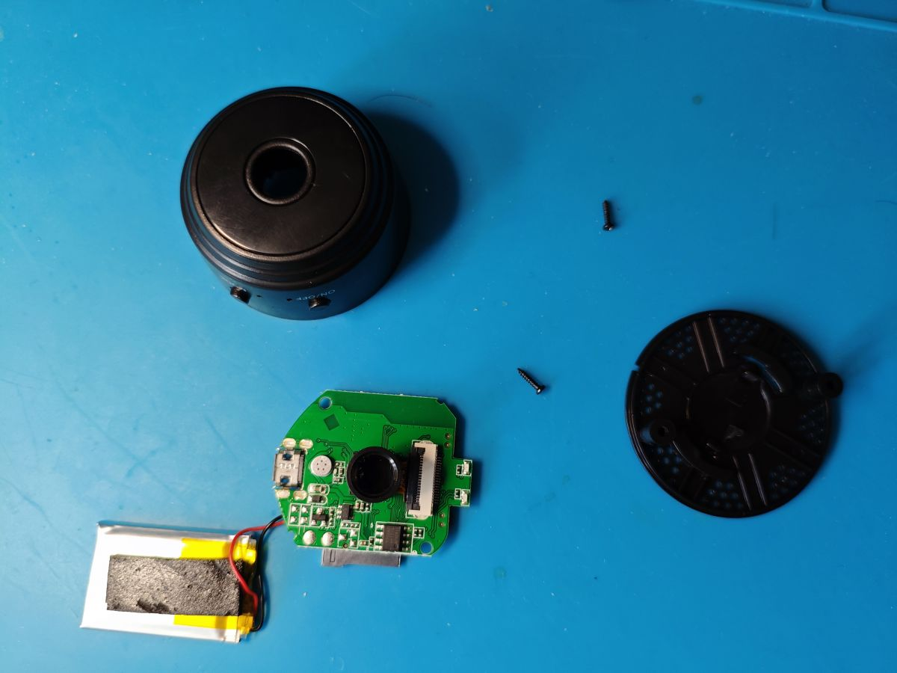
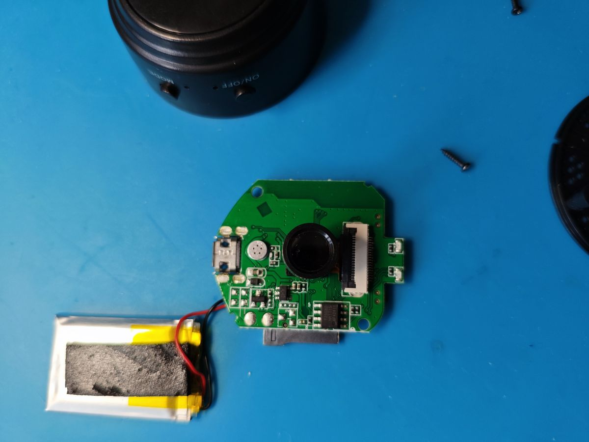
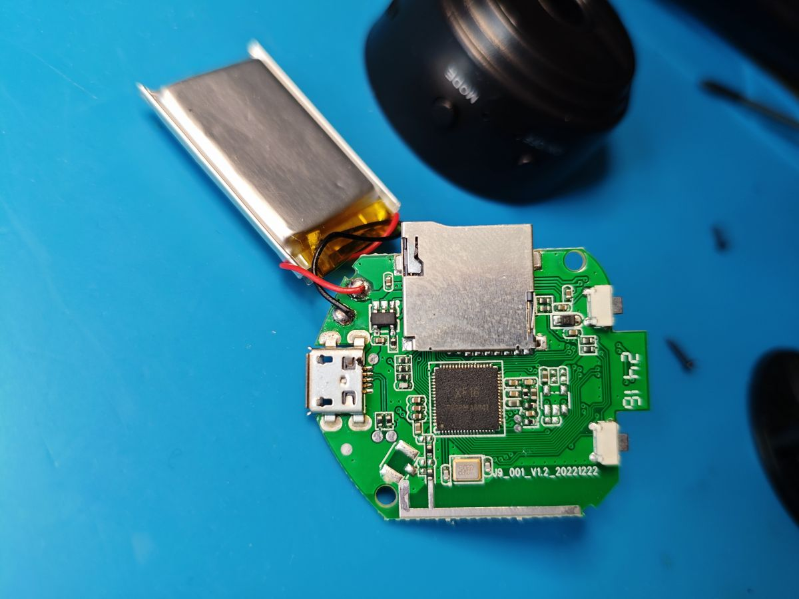

# XF16Cam hardware guide

[Project overview](../README.md) · [Flashing guide](flashing.md) ·
[Developer notes](../project/example/xf16cam/readme.md)

## Identifying the supported A9

“A9” is used for a family of inexpensive camera enclosures and retail listings;
it does not identify the electronics inside. XF16Cam supports the 1 MiB board
with an `XF16`-marked processor, not visually similar Beken or Taixin boards.

<table>
  <tr>
    <td></td>
    <td></td>
  </tr>
  <tr>
    <td align="center">Camera side</td>
    <td align="center">Processor and microSD side</td>
  </tr>
</table>

Check for all of the following before flashing:

- A large square 68-pin IC marked `XF16`, often `XF16 PB380EA6341`.
- A separate 8-pin, 1 MiB/8 Mbit SPI flash. Seen parts include `T25S80`,
  `TJ25Q08M`, and `ZB25WD80`; factory units have reported JEDEC IDs including
  `C7 40 14` and `5E 32 14`.
- A microSD socket, micro-USB connector, two side buttons, and an 18-pin FFC/ZIF
  camera connector arranged like the photographs.
- On the photographed board, silkscreen `J9_001_V1.2_20221222`. This is a useful
  clue rather than a requirement because other revisions may exist.

If the main IC says `BK7252`, `BK7252N`, `TXW817`, or anything other than XF16,
stop. Firmware for those A9 variants is not interchangeable.

## XF16 and XR872ET

There is no public XF16 datasheet that describes this exact package. The
relationship is established from several independent pieces of hardware and
firmware evidence:

- The factory image contains the path `project/demo/ilnk_demo_et_1mflash` and
  strings naming XR872ET A9 board profiles.
- Its boot log identifies the XRADIO Skylark SDK, a 240 MHz CPU, a 40 MHz high-
  frequency clock, XIP, and XR-series WLAN firmware.
- ROM images recovered from an XF16 A9 and an XR872ET Kement device were
  identical in community comparison.
- XF16Cam builds and runs against the XR872 target in the Skylark SDK, without
  PSRAM.

The package distinction matters: the XF16 on this board has 68 pins, while the
catalogue XR872ET is QFN40 (and XR872AT is another, PSRAM-equipped variant).
The safest description is therefore **a custom 68-pin XR872ET-family
implementation/software-compatible derivative**, not an officially documented
drop-in rebadge.

Sources: [initial teardown and factory strings](https://www.elektroda.com/rtvforum/topic4074636.html#21219273),
[ROM comparison](https://www.elektroda.com/rtvforum/topic4074636-300.html#21934389),
and the [XR872 product brief](https://github.com/XradioTech/xradiotech-wiki/wiki/doc/XR872/XR872_Product_Brief.pdf).

## Known pin map

| Function | XF16 pin(s) | Notes |
| --- | --- | --- |
| Camera data D0–D7 | PA0–PA7 | Parallel CSI data bus |
| Camera PCLK | PA8 | Sensor profile selects the active edge |
| Camera MCLK | PA9 | 24 MHz for the current sensor profiles |
| Camera HSYNC/HREF | PA10 | Polarity is sensor-profile controlled |
| Camera VSYNC/VREF | PA11 | Polarity is sensor-profile controlled |
| Camera control | PA14 | Board-specific sensor control |
| Mode button | PA15 | Active-low, internal pull-up |
| Battery divider | PA16 / ADC6 | Approximate measurement only |
| Camera SCCB SCL | PA17 | I2C0/SCCB sensor clock |
| Camera SCCB SDA | PA18 | I2C0/SCCB sensor data |
| Setup/wake button | PA20 | Active-low, internal pull-up; wake input 6 |
| Status LED | PA21 | Firmware-controlled |
| Camera/SD rail | PA23 | Shared peripheral rail, not a battery disconnect |
| UART console | PB0 TX, PB1 RX | 115200 8N1; used for logging and recovery |
| SPI flash | PB2–PB7 | External 1 MiB system flash |
| SD card | PB16 CMD, PB17 D0, PB18 CLK | One-bit SD mode |
| Microphone | Internal-codec AMIC | Analogue input, not a GPIO |

The 18-pin camera-connector mapping was confirmed by continuity tracing and GPIO
walking during the [XF16 investigation](https://www.elektroda.com/rtvforum/topic4074636-270.html#21732686).
Do not assume that an arbitrary 18-pin module uses the same contact orientation;
some camera ribbons expose their contacts on the opposite face.

## Buttons and LEDs

| Part | Behaviour |
| --- | --- |
| PA15 button | A debounced press and release toggles Browser MJPEG/RTSP, persists the mode, and reboots. |
| PA20 button | Holding for 3 seconds restores the open setup AP and reboots. A falling edge is configured to wake the MCU from manual hibernation. |
| PA21 LED | Blinks at startup, stays on once services are ready, and turns off before hibernation. It is usually the blue LED on the tested A9. |
| Red LED | XF16Cam never drives it. Its connection and possible charging indication are not yet characterised. |

## Camera sensors

XF16Cam probes the sensor at boot and selects a small descriptor containing the
SCCB address/ID, register table, geometry, CSI byte order, and signal polarities.
A missing or unsupported sensor is non-fatal: Wi-Fi, the web console, OTA,
audio, storage, and diagnostics still start.

| Sensor | Probe ID | Output | Validation |
| --- | --- | --- | --- |
| GC0328 | `9d` | 320 × 240 | XF16 A9 hardware-tested |
| GC0329 | `c0` | 320 × 240 / 640 × 480 | XF16 A9 hardware-tested |
| GC0308 | `9b` | 320 × 240 / 640 × 480 | Driver included; hardware needed |
| GC0309 | `a0` | 320 × 240 / 640 × 480 | XF16 A9 hardware-tested |
| GC0310 | `a3:10` | 320 × 240 / 640 × 480 | XF16 A9 hardware-tested |
| GC0311 | `bb` | 320 × 240 / 640 × 480 | XF16 A9 hardware-tested |
| GC0312 | `b3:10` | 320 × 240 / 640 × 480 | XF16 A9 hardware-tested |
| HI704 | `96` | 320 × 240 / 640 × 480 | XF16 A9 hardware-tested; rising PCLK |
| OV7690 | `76:91` | 320 × 240 / 640 × 480 | Driver included; hardware needed |
| SP0A19 | `a6` | 320 × 240 / 640 × 480 | XF16 A9 hardware-tested |
| SP0A20 | `2b` | 320 × 240 / 640 × 480 | XF16 A9 hardware-tested |
| SP0A39 | `0a:39` | 320 × 240 / 640 × 480 | Video community-tested on XF16 PTZ; A9 test pending |
| SP0828 | `0c` | 240 × 320 portrait | XF16 A9 hardware-tested |

The [sensor-module research thread](https://www.elektroda.com/rtvforum/topic4121965.html)
collects ribbon markings, photographs, and boot-log IDs for many of these parts.
XF16Cam does not currently implement PTZ motors or IR-illuminator control.

## Storage and microphone

The microSD socket operates in one-bit mode. XF16Cam can probe/mount a card,
show total and free space, format it as FAT32, and safely eject it. It does not
yet record stills, audio, or video. The camera and SD socket share the PA23
rail, so the firmware reference-counts users before turning that rail off.

The small metal microphone is connected to the XF16/XR872 analogue microphone
input. Capture starts only when a browser or RTSP audio client needs it. The
stream is mono PCMU at 8 kHz; the first 2.1 seconds are deliberately silent
while the analogue path settles.

## Battery and power

Factory-firmware analysis identifies PA16/ADC6 as a battery-divider input with
an approximate 1.7:1 ratio. XF16Cam reports the median of eleven ADC samples and
can enter hibernation manually, with PA20 configured as the wake input.

This is still experimental:

- The voltage scale has not been calibrated against a known-good battery and
  multimeter.
- With no battery attached, the input may read zero, float, or follow part of
  the charger circuit; it is not a meaningful USB-supply measurement.
- No dependable charger-status signal or battery-presence test is known.
- Hibernation wake still needs validation with healthy battery hardware.
- XF16Cam does not estimate percentage or hibernate automatically at low
  voltage.
- The red LED is not controlled or characterised.

Do not reuse a swollen or damaged pouch cell. Disconnect it, keep it away from
metal tools, and follow local battery-disposal guidance rather than attempting
to charge it during development.
